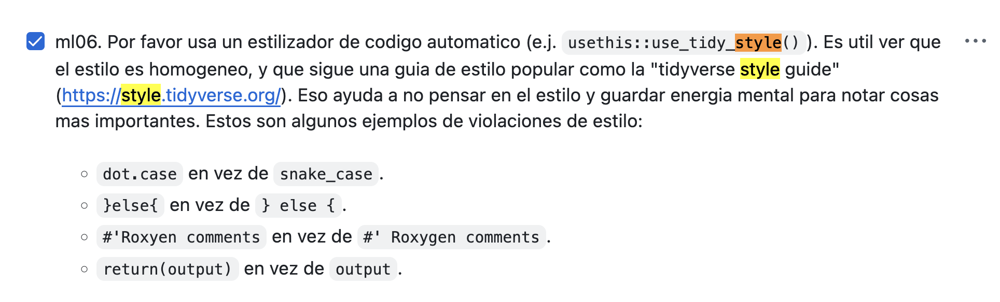
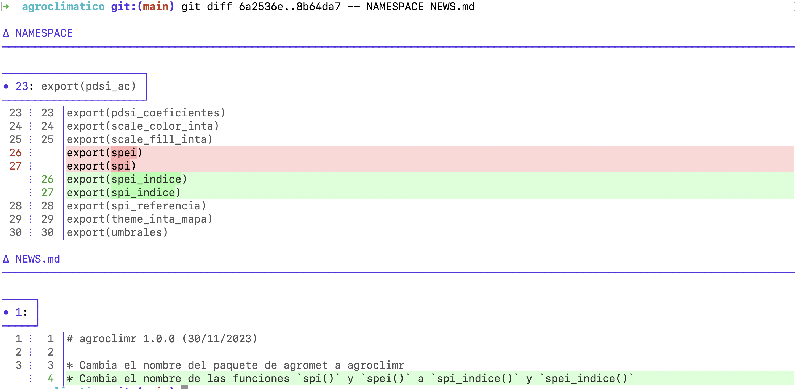
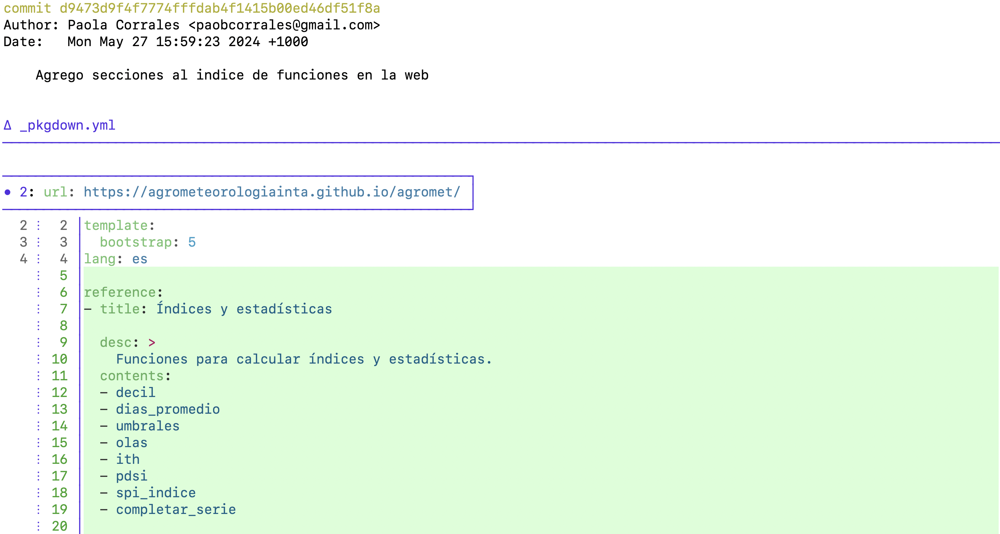
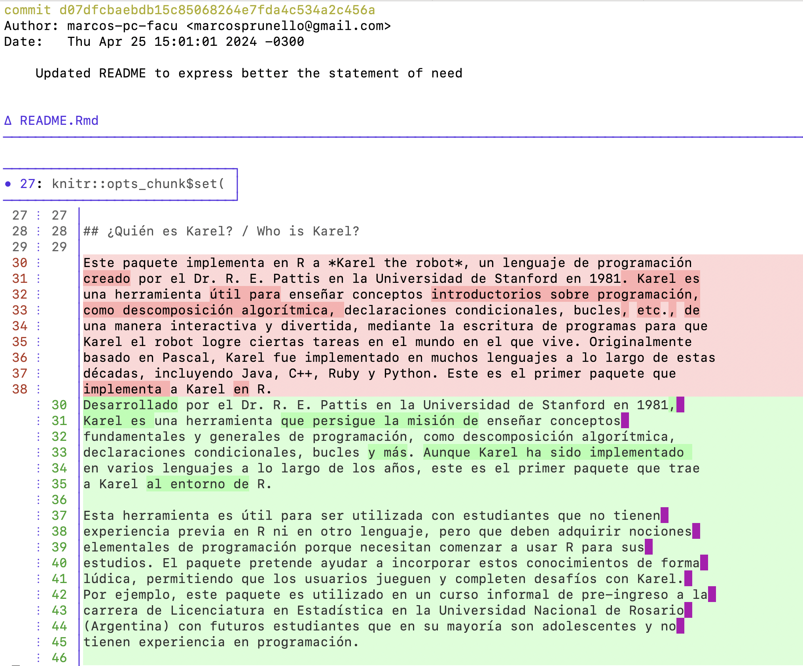

# Introducción al taller

Sobre [ustedes](https://ropensci.org/es/champions/) 🏅🇪🇸 y sobre [mí](https://ropensci.org/author/mauro-lepore/) 👋.

<sub>
Licencia: [Atribución/Reconocimiento-NoComercial 4.0 Internacional](https://creativecommons.org/licenses/by-nc/4.0/deed.es)
</sub>

## Objetivos principales

Día 1

- Familiarizarse con las etapas y cualidades del proceso
- Practicar proponer software para revisión

Día 2

- Practicar enviar software para revisión

## Plan para el dia 1

* Introducción al taller
* Introducción al proceso de punta a punta
  - Comparación con la academia
  - Proponer y enviar software para revisión
  - {pkgcheck}
  - Código de conducta y comunicación
* Pausa
* Proponer software para revisión
  - Abrir un "issue"
  - Comunicación amable y constructiva
* Preguntas y comentarios

# Introducción al proceso de punta a punta

Sobre cómo trabajamos con [software](https://devguide.ropensci.org/es/index.es.html) y [personas](https://ropensci.org/es/c%C3%B3digo-de-conducta/)

## Comparación con la academia

En la academia y en rOpenSci:

- ¿Cuál es la motivación de un/a autor/a o revisor/a?
- ¿Qué otros roles participan?
- ¿Cuándo se acepta o rechaza un trabajo?
- ¿En qué plataforma se intercambian comentarios?
- ¿Cómo es la comunicación esperada?

## [Proponer software para revisión](https://github.com/ropensci/software-review/issues?q=is%3Aissue%20state%3Aopen%20label%3A0%2Fpresubmission)

```{mermaid}
flowchart LR
    B((1-Abrir issue))
    B --> C{2-¿Dentro del alcance?}
    C -->|No| E{3-¿Excepción?}
    C -->|Sí| D[4-Enviar]
    E -->|Sí| D
    E -->|No| G((5-Cerrar issue))
```

## [Enviar software para revisión](https://github.com/ropensci/software-review/issues?q=is%3Aissue%20state%3Aopen%20-label%3A0%2Fpresubmission)

```{mermaid}
flowchart LR
    B((1-Abrir issue))
    B --> C[2-Revisar]
    C --> D{3-¿Listo?}
    D -->|No| C
    D -->|Sí| E((Publicar))
```

## {pkgcheck}: Uso en un "issue"

```r
@ropensci-review-bot check package
```

[Ejemplo](https://github.com/ropensci/software-review/issues/593#issuecomment-1608404055)

:::aside
[Comandos del bot](https://devguide.ropensci.org/es/bot_cheatsheet.es.html)
:::

## {pkgcheck}: Uso local

Instalación

```r
  options (repos = c (
    ropenscireviewtools = "https://ropensci-review-tools.r-universe.dev",
    CRAN = "https://cloud.r-project.org"
  ))
  install.packages("pkgcheck")
```

Ejemplo

```r
  paquete <- "/camino/al/paquete"
  resultados <- pkgcheck::pkgcheck(paquete)
  resultados
  
  summary(resultados)
```

:::aside
[Documentación de {pkgcheck}](https://docs.ropensci.org/pkgcheck/)
:::

## Código de Conducta

- La comunidad de rOpenSci es lo más importante. 
- Nuestro objetivo es que las revisiones sean
  - abiertas, 
  - no conflictivas,  
  - y con el objetivo de mejorar la calidad del software.  
- ¡Sé amable! y comportate con respeto.

:::aside
[Guía para quienes hacen una revisión](https://devguide.ropensci.org/es/softwarereview_reviewer.es.html)  
[Guía para el equipo editorial](https://devguide.ropensci.org/es/softwarereview_editor.es.html)  
[Código de Conducta](https://ropensci.org/es/c%C3%B3digo-de-conducta/)  
:::

## Comunicación amable y constructiva

Ofrecer

- Seguridad
- Sugerencia/Decisión
- Seguimiento

::: aside
[Cómo ganar amigos e influir sobre las personas](https://www.amazon.com/-/es/influir-personas-Friends-Influence-Spanish/dp/164473009X)  
[Conversaciones Cruciales: herramientas para comunicar mejor cuando más se necesita](https://www.amazon.com/Conversaciones-Cruciales-Edici%C3%B3n-revisada-conocimiento-ebook/dp/B01EX1TZQG/ref=sr_1_1?adgrpid=167955646707&dib=eyJ2IjoiMSJ9.Ws1WzIBF0cC2Dm2-H47hguDVuXRPmMy9rZLGRYA4t3ER8EP9QL1L1dPW8a2l0c2aI65gElZhBVvYTfIcqtuaBVQcnOAmIBffgVzFQKm44rUISeaXgEIVBBw4-muztHHDiwE9jwRJSFYtSDFMAq4h9Rvb-GvpCxfZNzbfBApAjBAXNIQ63XVjTnFrOly1C-YCBSC8uEVyOljvl5CfMMfShGRKX-fYLjSLXyU0CJW-xuk.LRH-a9xfbt1VH_6O1wTX-6nxoUp_g1gSKmBPfElISuA&dib_tag=se&hvadid=730129623296&hvdev=c&hvlocphy=9070297&hvnetw=g&hvqmt=e&hvrand=357311298508997420&hvtargid=kwd-319512755646&hydadcr=23800_13790585&keywords=conversaciones+cruciales&mcid=bd94c27aa7253eda9e137472f79bfcd2&qid=1763123775&sr=8-1)
:::

## Comunicación amable y constructiva

Explica cómo y por qué el paquete encaja en estas categorías.

> `@autor/a`: No encontré una categoría que se ajustara perfectamente, por lo que creé una categoría nueva.

**Del 1 al 10, cuántos puntos le das a cada respuesta?**

<details><summary>Respuesta 1</summary>

`@editor/a`:

> @autor/a,  
> Lamentablemente nuestras categorías están pre-definidas. Esperamos ampliarlas gradualmente, pero no podemos acomodar paquetes individuales.

</details>

<details><summary>Respuesta 2</summary>

`@editor/a`:

> @autor/a gracias por tu consulta. El paquete parece muy interesante pero lamentablemente está fuera del alcance de las categorías actuales de rOpenSci. Nuestras categorías están pre-definidas. Esperamos ampliarlas gradualmente, pero no podemos acomodar paquetes individuales.

</details>

<details><summary>Respuesta 3</summary>

`@editor/a`:

> @autor/a gracias por tu consulta. El paquete parece muy interesante pero lamentablemente está fuera del alcance de las categorías actuales de rOpenSci. Nuestras categorías están pre-definidas. Esperamos ampliarlas gradualmente, pero no podemos acomodar paquetes individuales.

> Te recomendaría revisar y publicar el paquete en el [Journal of Open Source Software](https://joss.theoj.org/).

> Espero que pronto podamos trabajar con vos en algún otro paquete.

</details>

<sub>
[Decidir el alcance y el solapamiento](https://devdevguide.netlify.app/es/softwarereview_editor.es#decidir-el-alcance-y-el-solapamiento)
</sub>

# Pausa 10'

# Proponer software para revisión

## Abrir un "issue"

Abrí un "issue" para proponer software para revisión en el [repositorio de práctica](https://github.com/ropensci-training/software-review/issues)

Usá tu propio paquete o cualquiera de estos:

- [{agroclimatico}](https://github.com/ropensci/software-review/issues/599): Índices y Estadísticos Climáticos e Hidrológicos
- [{eph}](https://github.com/ropensci/software-review/issues/593): Encuesta Permanente de Hogares de Argentina
- [{karel}](https://github.com/ropensci/software-review/issues/620): Aprendiendo programación en R

## Comunicación amable y constructiva

- [{karel}](https://docs.ropensci.org/karel/) está fuera del alcance de las categorías de rOpenSci ([fue revisado](https://github.com/ropensci/software-review/issues/620) como excepción por el programa de campeones/as)

- Asumí el rol de editor/a

- Escribí un comentario amable y constructivo, notificando al autor que el paquete está fuera del alcance de rOpenSci

- Recomendá revisarlo y publicarlo en el ["Journal of Open Source Education"](http://jose.theoj.org/)

# Preguntas y comentarios

# Introducción al día 2

¿Qué vimos en el día 1? ¿Qué vamos a ver hoy?

## Plan para el día 2

* Repaso
* Preparar un paquete
* Revisar un paquete: Introducción
* Pausa
* Revisar un paquete: Actividad
* Responder a una revisión
* Preguntas y respuestas

## Repaso: Proponer software

El paquete [karel](https://github.com/ropensci/software-review/issues/620) enseña a programar. Su objetivo está fuera del alcance de rOpenSci. Fue propuesto para revisión en 2023, durante el programa de campeones/as.

¿Es correcto que haya sido revisado en rOpenSci?

1. No porque no encaja en el alcance
1. Sí porque aunque no encaja en el alcance es una excepción
1. Sí porque rOpenSci no rechaza paquetes

<details><summary>[Proponer software para revisión](https://github.com/ropensci/software-review/issues)</summary>

```{mermaid}
flowchart LR
    B((1-Abrir issue))
    B --> C{2-¿Dentro del alcance?}
    C -->|No| E{3-¿Excepción?}
    C -->|Sí| D[4-Enviar]
    E -->|Sí| D
    E -->|No| G((5-Cerrar issue))
```

</details>

## Repaso: Comunicación

¿Por qué preferimos la segunda respuesta?

1. De hecho preferimos la primera porque comunica la misma decisión pero es más corta.
1. Porque es más políticamente correcta.
1. Porque demuestra que rOpenSci es un espacio seguro para hacer consultas, sugiere un foro alternativo, e invita futuras contribuciones.

<details><summary>Respuesta 1</summary>

> @autor/a,
> Lamentablemente este paquete está fuera del alcance actual de rOpenSci.  
</details>

<details><summary>Respuesta 2</summary>

> @autor/a,
> Gracias por tu consulta. Tu paquete se ve muy interesante, pero lamentablemente parece no encajar en las categorías actuales de rOpenSci.
> Te recomendaría publicarlo en el [Journal of Open Source Software](https://joss.theoj.org/), el [r-multiverse](https://r-multiverse.org/overview.html) u [otros repositorios](https://r-multiverse.org/overview.html#other-repositories). Y si tenés otro paquete o querés [explorar cómo contribuir de otra forma](https://contributing.ropensci.org/), será un gusto guiarte.

</details>

# Enviar software para revisión

## Preparar un paquete

Genera, interpreta, y responde a resultados de [{pkgcheck}](https://docs.ropensci.org/pkgcheck/)

<details><summary>Instalación</summary>

```r
  options (repos = c (
    ropenscireviewtools = "https://ropensci-review-tools.r-universe.dev",
    CRAN = "https://cloud.r-project.org"
  ))
  install.packages("pkgcheck")
```

</details>

Usa cualquier paquete, e.g. [{saperlipopette v0.1.0}](https://github.com/ropensci-training/saperlipopette)

<details><summary>Clonálo y retrocede a v0.1.0</summary>

```bash
git clone https://github.com/ropensci-training/saperlipopette
cd saperlipopette
git checkout v0.1.0
```

</details>

```r
# pak::pak()
out <- pkgcheck::pkgcheck()
summary(out)

out
```

<details><summary>Mejoras</summary>

```r
# install.packages("usethis")

# ✖ does not have a 'contributing' file.
usethis::use_tidy_contributing()

# ✖ Package has no HTML vignettes
usethis::use_article("saperlipopette")

# ✖ These functions do not have examples: [create_all_exercises].
# From https://github.com/ropensci-training/saperlipopette/blob/main/R/create-all.R
#' @examplesIf interactive()
#' parent_path <- withr::local_tempdir()
#' path <- create_all_exercises(parent_path = parent_path)
#
# devtools::document()
```

</details>

## Revisar un paquete

Propone (solo) una mejora. Usa la [plantilla de revisión](https://github.com/ropensci-training/software-review/blob/main/templates/es/revision.md).

Podés usar tu paquete o alguno de estos -- **antes de la revisión**:

<details><summary>[{agroclimatico}](https://github.com/ropensci/agroclimatico): Índices y Estadísticos Climáticos e Hidrológicos</summary>

```bash
git clone https://github.com/ropensci/agroclimatico
cd agroclimatico
git checkout -b antes d537dd20
```

</details>

<details><summary>[{eph}](https://github.com/ropensci/eph): Encuesta Permanente de Hogares de Argentina</summary>

```bash
git clone https://github.com/ropensci/eph
cd eph
git checkout -b antes 707cd24c
```

</details>

<details><summary>[{karel}](https://github.com/ropensci/karel): Aprendiendo programación en R</summary>

```bash
git clone https://github.com/ropensci/karel
cd karel
git checkout -b antes 4b057e67
```

</details>

<details><summary>Ejemplos</summary>

{eph}: Usar un estilizador de código automático ([revisión](https://github.com/ropensci/software-review/issues/593#issuecomment-1624466962) - [commit](https://github.com/ropensci/eph/commit/eca3401fb59ad9d9cdb14abcea7b96565fff6161)).




{eph}: Mostrar el output de los ejemplos en README ([revisión](https://github.com/ropensci/software-review/issues/593#issuecomment-1624466962) - [commit](https://github.com/ropensci/eph/commit/322d7003fccdf06e68e03cc4aa0a034fda3a4721)).

> En la sección "Modo de uso", por favor mostrar los resultados así se ven sin necesidad de instalar el paquete y correr el código.


{agroclimatico}: Renombrar funciones ([revisión](https://github.com/ropensci/software-review/issues/599#issuecomment-1704935695) - [commit](https://github.com/ropensci/agroclimatico/commit/8b64da7f0c41ef1d87a621d2c506f7af75adeb79)).

> podría plantearse un ligero cambio de nombre para evitar la confusión



{agroclimatico}: Agrupar funciones ([revisión](https://github.com/ropensci/software-review/issues/599#issuecomment-1941871544) - [commit](https://github.com/ropensci/agroclimatico/commit/d9473)).

> Una sugerencia para que quede más clara la funcionalidad global del paquete es agrupar las funciones en el índice por temáticas.



{karel}: Expresar la necesidad del paquete en README ([revisión](https://github.com/ropensci/software-review/issues/620#issuecomment-2033093650) - [commit](https://github.com/ropensci/karel/commit/d07dfcbaebdb15c85068264e7fda4c534a2c456a)).

> Add statement of need. The `Who is Karel?` section of the README hints at the need but does not describe it explicitly.



</details>

## Responder a una revisión

Combina habilidades que ya practicamos.

Ejemplos de revisión y respuesta en {agroclimatico}

<details><summary>[Revisión de `@VeruGHub` (revisora)](https://github.com/ropensci/software-review/issues/599#issuecomment-1936698026)</summary>

Seguridad

> En primer lugar, quiero agradecer la oportunidad de revisar este paquete y espero que los comentarios sirvan para mejorar en los puntos que los autores consideren oportunos.

Sugerencia/Decisión

> Creo que algunos aspectos formales de la documentación pueden ser mejorados. Para empezar, la funcionalidad del paquete no está completamente definida en la documentación (Readme) ... Mejorar estas descripciones e incluir programación defensiva relativa a los argumentos (en general faltante) ayudaría mucho a los usuarios.

</details>

<details><summary>[Respuesta de `@paocorrales` (autora)](https://github.com/ropensci/software-review/issues/599#issuecomment-2143389578)</summary>

Seguridad

> En primer lugar, muchas gracias @pmnatural y @VeruGHub por la revisión y los comentarios.

Sugerencia/Decisión

> Incorporé los comentarios y sugerencias al paquete.

Seguimiento

> Espero no haberme olvidado de nada, ¡aguardo sus comentarios!

</details>

Ejemplo de oposición a una sugerencia en {eph}

<details><summary>[Respuesta de `@caropradier` (autora)](https://github.com/ropensci/software-review/issues/593#issuecomment-1714421144)</summary>

Seguridad

> @lidefi87 ¡gracias de nuevo por tus esfuerzos!

Sugerencia/Decisión

> Respecto al nombre de las funciones, intentaría no hacer modificaciones mayores para no perturbar el flujo de trabajo de nuestros usuarios actuales (aproximadamente 30 mil personas usan el paquete y quisiera evitar generarles inconvenientes si no se trata de algo fundamental para el funcionamiento del paquete). No obstante, estoy de acuerdo con que se trata de una buena práctica, y lo tendré presente al incorporar nuevas funciones.

</details>

<sub>
[Responder a las preguntas del equipo de revisión](https://devdevguide.netlify.app/es/softwarereview_editor.es#reviewersupport)
</sub>

# Preguntas y comentarios

# ¡Gracias!

¿Querés revisar un paquete?
[Postulate acá](https://devdevguide.netlify.app/es/softwarereview_reviewer.es#volunteering-as-a-reviewer)

# Recursos

Taller

- <https://github.com/ropensci-training/software-review>
- [Documento colaborativo](https://docs.google.com/document/d/1Af5ZjV8HJNVeTtGLBKOHkyQISand6-E3HLtI9qa-od8/edit?tab=t.0)

Comunicación

- [Código de Conducta](https://ropensci.org/es/c%C3%B3digo-de-conducta/)

Revisión

- [Propone o enviá software para revisión](https://github.com/ropensci/software-review/issues/new/choose)
- [Guía de desarrollo](https://devdevguide.netlify.app/es/index.es)
  - [Categorías de paquetes](https://devdevguide.netlify.app/es/softwarereview_policies.es.html#package-categories)
  - [Para quienes crean paquetes](https://devdevguide.netlify.app/es/softwarereview_author.es)
  - [Para quienes hacen una revisión](https://devdevguide.netlify.app/es/softwarereview_reviewer.es)
- [Guía de software estadístico](https://stats-devguide.ropensci.org/)
- [pkgcheck](https://docs.ropensci.org/pkgcheck/)
- [Plantilla de revisión](https://devdevguide.netlify.app/es/reviewtemplate.es)
- [r-multiverse](https://r-multiverse.org/)

Blogs sobre el proceso de revisión

- [Revisión del software, perspectivas de un académico](https://ropensci.org/es/blog/2025/03/25/r-package-review/)
- [Experiencias revisando paquetes de rOpenSci por primera vez](https://ropensci.org/es/blog/2017/09/08/first-review-experiences/)
- [Así que (no) crees que puedas revisar un paquete](https://ropensci.org/es/blog/2017/08/22/first-package-review/)

Paquetes de campeones/as en español

- [eph](https://github.com/ropensci/software-review/issues/593)
- [agroclimatico](https://github.com/ropensci/software-review/issues/599)
- [karel](https://github.com/ropensci/software-review/issues/620)

[Ofrecerte como voluntario/a para revisar](https://devdevguide.netlify.app/es/softwarereview_reviewer.es#volunteering-as-a-reviewer)
